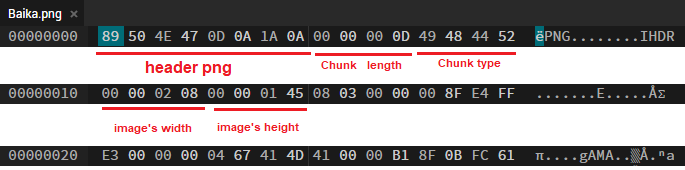
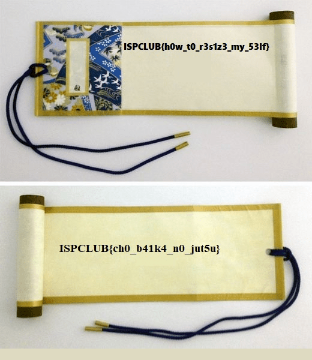

# WRITEUP

Mở ảnh bằng một hex editor để xem cấu trúc của tệp ảnh.

Định đạng của tệp PNG có cấu trúc như sau:
- 8 bytes đầu là header của tệp PNG
- Sau header sẽ là các Chunks, mỗi Chunk sẽ gồm 4 đoạn Length (4 bytes), Chunk type (4 bytes), Chunk data (Length bytes), CRC (4 bytes)
- ... [xem thêm](https://en.wikipedia.org/wiki/Portable_Network_Graphics#File_format)

Chunk type đầu tiên của ảnh này là IHDR vì vậy theo sau đó sẽ lần lượt là chiều rộng (4 bytes) và chiều cao (4 bytes) của ảnh.

Đề bài yêu cầu ta sửa kích thước của ảnh vì vậy ta sẽ sửa kích thước ảnh từ 520x325 thành 520x600 (làm cho ảnh dài hơn vì nếu để ý ta sẽ thấy có một bức ảnh ở dưới nữa)

Lưu ý: Tệp 'Baika_out.png' đã được chỉnh sửa lại để có thể hiển thị được trên markdown

Flag thu được:
> ISPCLUB{ch0_b41k4_n0_jut5u}
