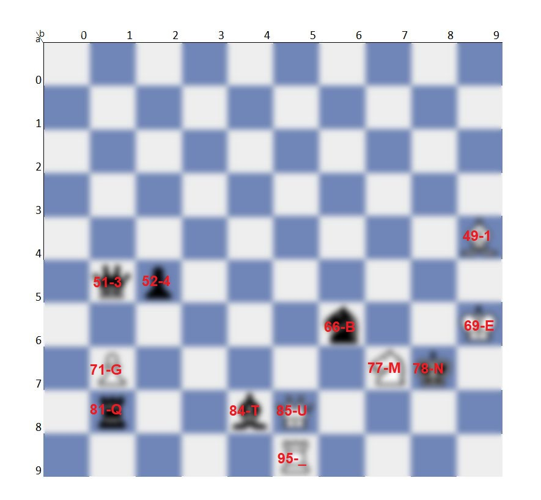

# WRITEUP

## Chess to letters

Bàn cờ có kích thước 10x10 như muốn gợi ý cho ta điều gì đó liên quan tới hệ thập phân, các quân cờ cũng tập chung về phía dưới của bàn cờ, như vậy ta có thể nghĩ tới toạ độ của các ô chứa quân cờ sẽ đại diện cho giá trị của mã ascii.

Giá trị các ô nằm trong khoảng từ 49 đến 85 đây là khu vực chứa các số và chữ cái, có một kí tự đặt biệt là underscore (95) ngăn cách giữa 2 từ củng cố vững chắc cho giải thuyết trên.

Giá trị các số là 1, 3 và 4 được thay thế cho các kí tự I, E và A. Được sử dụng thường xuyên trong các bài trước cũng như hay được sử dụng trong các CTF khác.

Các kí tự thu được
> 134BEGMNQTU_ ---> IEABEGMNQTU_

## Letters to words

Trò chơi được chuyển về thành sắp xếp chữ cái thành một từ (scramble), ta sẽ sử dụng một từ điển giải trò này trên internet để giải.

https://lettersolver.com/words-for/IEABEGMNQTU/?dictionary=all_en

Ta tìm được từ "queen" liên quan tới cờ vua, loại bỏ các kí tự của từ này khỏi danh sách kí tự ta tìm được "gambit" ghép lại sẽ là "gambit queen" tìm kiếm từ khoá này trên google thì đây là một bộ phim.

Khôi phục lại các ký tự số ta có 2 flag hợp lệ, thử lần lượt nhé vì mình không nhớ rõ cái nào mới chính xác
> ISPCLUB{G4MB1T_QU3EN}

> ISPCLUB{G4MB1T_QUE3N}