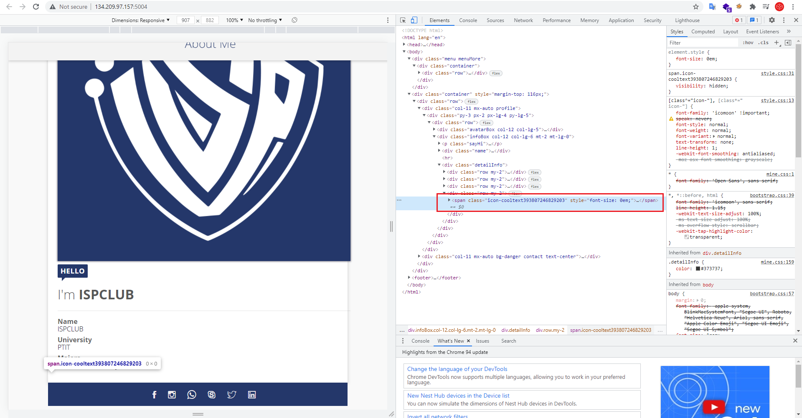
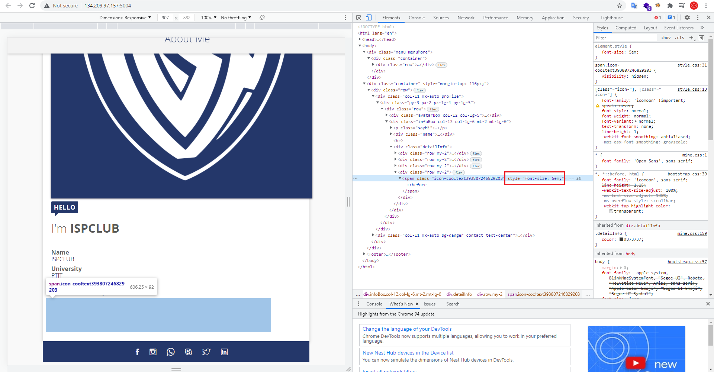
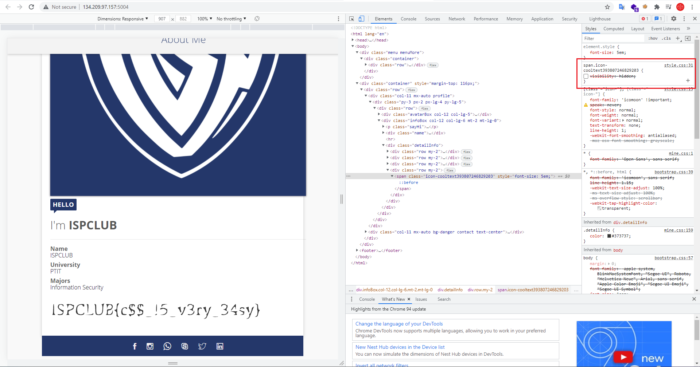

# WRITEUP

* Mở Inspect để kiểm tra.

* Phát hiện có 1 tag `span` ko hiển thị do size 0em.

* Tăng `font-size` lên 5em vẫn không hiển thị.
  

* Vào phần css thấy rằng nó bị ẩn đi bởi `visibility: hidden`. Ta tiến hành tắt nó đi.

> 

